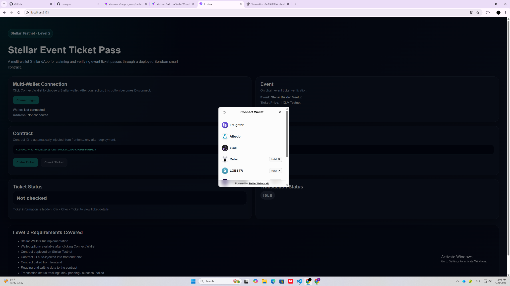
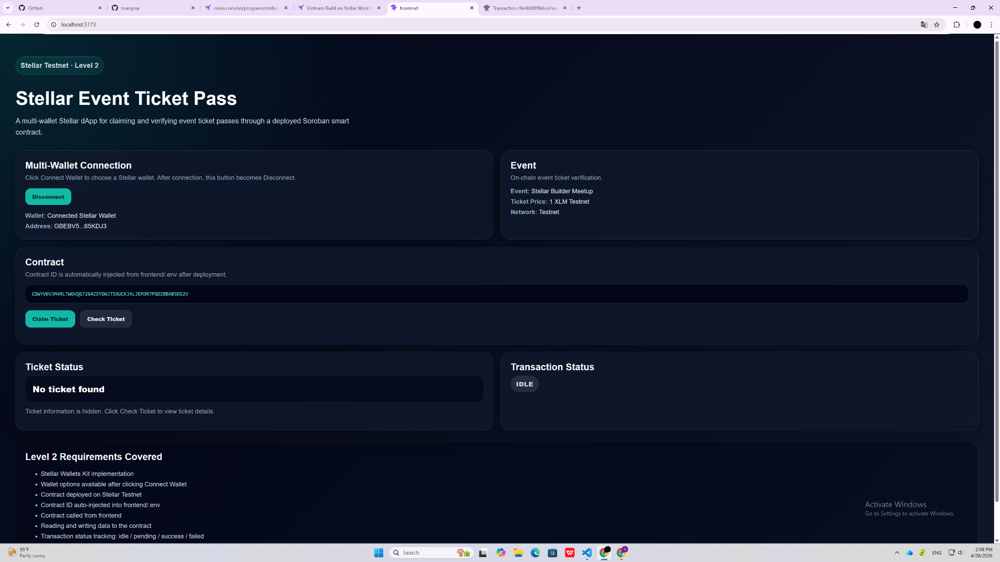
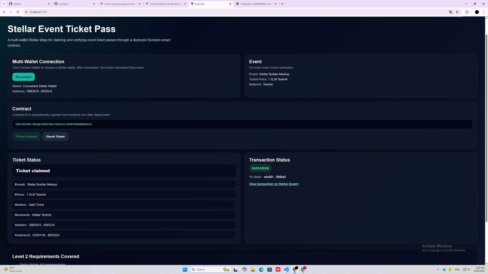

# Stellar Event Ticket Pass

A Level 2 Stellar Testnet dApp that allows users to connect a Stellar wallet, claim an event ticket pass, check ticket ownership, and view transaction status after calling a deployed Soroban smart contract.

---

## Overview

**Stellar Event Ticket Pass** is a simple event ticket pass dApp built on Stellar Testnet.

The project demonstrates a complete basic ticket claiming flow:

1. User connects a Stellar wallet.
2. User claims one event ticket pass.
3. The frontend calls a deployed Soroban smart contract.
4. The app displays transaction status and transaction hash.
5. User can check whether the connected wallet owns a ticket.
6. If the wallet owns a ticket, the app displays ticket details.

This project is designed for **Stellar Level 2**, focusing on:

- Multi-wallet integration
- Smart contract deployment
- Contract calls from frontend
- Read and write contract interaction
- Transaction status tracking
- Basic state synchronization between contract and UI

---

## Features

Users can:

- Connect a Stellar wallet through Stellar Wallets Kit
- Choose a wallet from the wallet options modal
- View connected wallet address
- Disconnect wallet
- Claim one event ticket pass
- Prevent duplicate ticket claims from the same wallet
- Check whether the connected wallet already owns a ticket
- View ticket information after clicking **Check Ticket**
- Track transaction status after calling the contract
- View transaction hash after a successful contract call
- Open the transaction on Stellar Expert

---

## Level 2 Requirements Covered

| Requirement | Status |
|---|---|
| Multi-wallet integration | Completed |
| Wallet options available | Completed |
| Error handling | Completed |
| Contract deployed on Stellar Testnet | Completed |
| Contract called from frontend | Completed |
| Read data from contract | Completed |
| Write data to contract | Completed |
| Transaction status visible | Completed |
| Transaction hash shown | Completed |
| Minimum 2+ meaningful commits | Completed |

---

## Tech Stack

- React
- TypeScript
- Vite
- Stellar SDK
- Stellar Wallets Kit
- Soroban smart contract
- Stellar Testnet
- PowerShell deploy script

---

## Smart Contract

The Soroban smart contract is used to manage a simple event ticket pass system.

### Contract Functions

```rust
event_name()
```

Returns the event name.

```rust
ticket_price()
```

Returns the ticket price.

```rust
claim_ticket(user: Address)
```

Allows a user to claim one ticket.

```rust
has_ticket(user: Address)
```

Checks whether a wallet already owns a ticket.

```rust
total_tickets()
```

Returns the total number of claimed tickets.

---

## Ticket Logic

This basic version uses the following rule:

```text
1 wallet = 1 event ticket pass
```

If a wallet has already claimed a ticket, the app changes the button from:

```text
Claim Ticket
```

to:

```text
Ticket Claimed
```

This prevents the user from sending another transaction and paying an extra fee.

---

## Deployed Contract Address

```text
CDWYV6VJM4RLTWGVOG72G4ZSYDWJTSXUCKJALJEM3R7PGDZBBAB5DS2V
```

The contract ID is automatically injected into:

```text
frontend/.env
```

Example:

```env
VITE_STELLAR_NETWORK=testnet
VITE_CONTRACT_ID=CDWYV6VJM4RLTWGVOG72G4ZSYDWJTSXUCKJALJEM3R7PGDZBBAB5DS2V
VITE_STELLAR_RPC_URL=https://soroban-testnet.stellar.org
```

---

## Transaction Hash

Successful contract call transaction hash:

```text
efa3516b65665b800eb7bd1bcc41f961b00ff8e32f0c5cfac3cb19803228fb43
```

Stellar Expert transaction link:

```text
https://stellar.expert/explorer/testnet/tx/efa3516b65665b800eb7bd1bcc41f961b00ff8e32f0c5cfac3cb19803228fb43
```

This transaction hash comes from a successful **Claim Ticket** contract call on Stellar Testnet.

---

## Screenshots

Make sure all screenshots are stored in the `screenshots` folder.

### 1. Wallet Options Available

This screenshot shows the wallet selection modal after clicking **Connect Wallet**.

File path:

```text
screenshots/wallet-options.png
```

Markdown image:

```markdown

```

Preview:


---

### 2. Wallet Connected - No Ticket Found

This screenshot shows the wallet connected state before claiming a ticket.

File path:

```text
screenshots/wallet-connected-no-ticket.png
```

Markdown image:

```markdown

```

Preview:


---

### 3. Ticket Claimed Successfully

This screenshot shows:

- Ticket claimed status
- Ticket details
- Transaction status
- Transaction hash
- Stellar Expert transaction link

File path:

```text
screenshots/ticket-claimed-success.png
```

Markdown image:

```markdown

```

Preview:


---

## How It Works

### 1. Connect Wallet

The user clicks **Connect Wallet**.

Stellar Wallets Kit opens a wallet selection modal.

The user can choose a supported Stellar wallet, such as:

- Freighter
- Albedo
- xBull
- Other supported wallets shown by Stellar Wallets Kit

After the wallet is connected, the UI shows:

- Wallet status
- Connected address
- Disconnect button

---

### 2. Claim Ticket

After connecting a wallet, the user can click **Claim Ticket**.

The frontend calls the Soroban contract function:

```rust
claim_ticket(user: Address)
```

The app shows transaction status:

```text
idle → pending → success / failed
```

After a successful transaction, the app shows:

- Success status
- Transaction hash
- Stellar Expert link

---

### 3. Check Ticket

The user can click **Check Ticket** to check whether the connected wallet owns a ticket.

The frontend calls:

```rust
has_ticket(user: Address)
```

If the wallet owns a ticket, the app displays:

- Event name
- Ticket price
- Ticket status
- Network
- Holder address
- Contract address

If the wallet does not own a ticket, the app displays:

```text
No ticket found
```

---

## Error Handling

The app includes basic error handling for common wallet and transaction issues.

Handled cases include:

- Wallet not connected
- Wallet not found
- User rejected transaction
- Contract call failed
- Insufficient balance
- Duplicate ticket claim prevention

If the wallet already claimed a ticket, the app does not send a new transaction. Instead, the button becomes:

```text
Ticket Claimed
```

---

## Environment Variables

Create or update the file:

```text
frontend/.env
```

Example:

```env
VITE_STELLAR_NETWORK=testnet
VITE_CONTRACT_ID=CDWYV6VJM4RLTWGVOG72G4ZSYDWJTSXUCKJALJEM3R7PGDZBBAB5DS2V
VITE_STELLAR_RPC_URL=https://soroban-testnet.stellar.org
```

---

## Setup Instructions

### 1. Clone the repository

```bash
git clone YOUR_GITHUB_REPOSITORY_URL
cd Stellar-Event-Ticket-Pass
```

---

### 2. Install frontend dependencies

```bash
cd frontend
npm install
```

---

### 3. Run the frontend

From the project root:

```bash
npm run dev
```

Or from the `frontend` folder:

```bash
npm run dev
```

Open the app at:

```text
http://localhost:5173/
```

---

## Deploy Contract

From the project root, run:

```bash
npm run deploy:contract
```

The deploy script will:

1. Build the Soroban contract
2. Deploy the contract to Stellar Testnet
3. Generate a new contract ID
4. Automatically inject the new contract ID into:

```text
frontend/.env
```

This avoids manually copying and pasting the contract ID after each deployment.

---

## Build Frontend

To check that the frontend builds correctly:

```bash
npm run build:frontend
```

A successful build means the frontend TypeScript and Vite build are working.

---

## Project Structure

```text
Stellar-Event-Ticket-Pass
├── contracts
│   └── event-ticket
│       ├── Cargo.toml
│       └── src
│           └── lib.rs
│
├── frontend
│   ├── public
│   ├── src
│   │   ├── App.tsx
│   │   ├── App.css
│   │   ├── main.tsx
│   │   └── index.css
│   ├── .env
│   ├── package.json
│   └── vite.config.ts
│
├── scripts
│   └── deploy-contract.ps1
│
├── screenshots
│   ├── wallet-options.png
│   ├── wallet-connected-no-ticket.png
│   └── ticket-claimed-success.png
│
├── package.json
└── README.md
```

---

## Screenshots Folder

Create a folder named:

```text
screenshots
```

Then save the screenshots using these exact names:

```text
wallet-options.png
wallet-connected-no-ticket.png
ticket-claimed-success.png
```

GitHub will display the screenshots automatically in this README if the file paths are correct.

---

## Demo Flow

Recommended flow for testing:

1. Open the app.
2. Click **Connect Wallet**.
3. Select a Stellar wallet from the modal.
4. Confirm wallet connection.
5. Click **Check Ticket**.
6. If no ticket is found, click **Claim Ticket**.
7. Wait for transaction status to become `success`.
8. Copy the transaction hash.
9. Click the Stellar Expert link to verify the transaction.
10. Click **Check Ticket** again to view ticket details.

---

## Submission Checklist

Before submitting, make sure the repository includes:

- Public GitHub repository
- Complete README
- Setup instructions
- Minimum 2+ meaningful commits
- Deployed contract address
- Transaction hash of a contract call
- Screenshot of wallet options
- Screenshot of wallet connected state
- Screenshot of successful ticket claim

---

## Future Improvements

Future versions can include:

- Multiple tickets per wallet
- Ticket ID
- Claim timestamp
- QR code ticket
- QR check-in flow
- Event admin dashboard
- Ticket transfer
- Event history indexing
- Long-term transaction hash recovery
- Backend database for event indexing

---

## Notes

This project is built for Stellar Level 2 submission.

The current version focuses on a stable basic ticket pass flow:

```text
1 wallet = 1 event ticket pass
```

The app demonstrates how a frontend can connect to a Stellar wallet, call a deployed Soroban smart contract, track transaction status, and display ticket ownership information.